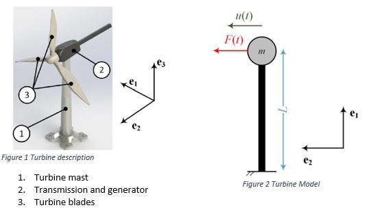
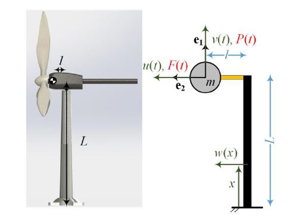
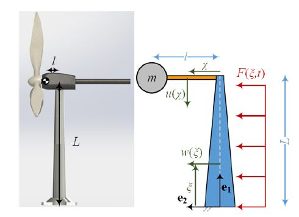

# Turbine-DynamicalAnalysis
Three part project for the dynamical analysis of a wind turbine with three blades
that is to withstand different wind speeds without braking
Each part complicats the model furthering our understanding but making sure the results are sensible
Full documentation inside.

## First Part:
1) Linear model of the system - Full EOM derived from power equations
2) Complete frequency and shock response analysis
3) Maxiaml stress as a function of wind speed
4) Adding non-linear springs to enforce damping
5) Show maximal stress improvement

## Second Part:
1) Two conjoined linear models - full EOM derived in the lagrangian method
2) System response for initial conditions
3)Analytical response to harmonic inputs
4) Maximal stress as a function of wind speed
5) Adding a mass damper to satisfy stress constraints
6) GUI for mass damper design included

## Third Part:
1) Two conjoined linear models - full EOM derived in the lagrangian method
 with Rayleigh-Ritz and Chebyshev polynomials
2) Constraints analysis for chosen number of polynomials
3) Modal analysis
4) Maximal stress as a function of wind speed
